# D11 Dependency Map — JASON-OS

**Agent:** D11 (Wave 2 Analysis)
**Date:** 2026-04-18
**Inputs consumed:** 13 Wave 1 JSONL files (D1a, D1b, D2, D3, D4a, D4b-1, D4b-2, D4b-3, D5, D6, D7, D8, D9)
**Total edges:** 204

---

## Section 1: Hub Units

Units ranked by total inbound edge count (things that depend on them).

### Tier 1 Hubs — Critical infrastructure (10+ inbound edges)

| Unit | Inbound Edges | Why it's a hub |
|------|--------------|----------------|
| `scripts/lib/safe-fs.js` | 14 | Consumed by every hook, every planning script, and the todo CLI. The universal safe I/O layer. |
| `scripts/lib/sanitize-error.cjs` | 10 | Hard-required by hooks (large-file-gate, settings-guardian), all planning scripts (todos-cli, todos-mutations, planning/lib/read-jsonl), and security-helpers. Single source of truth for error sanitization. |
| `skills/convergence-loop` | 9 | Called as a programmatic primitive by brainstorm, deep-plan, deep-research, skill-audit, and skill-creator. No direct tool call — embedded workflow. |
| `skills/deep-research` | 9 | Hub in both directions: spawns 9 agents, and is referenced by brainstorm/deep-plan/add-debt/convergence-loop/research-plan-team as upstream or downstream. |
| `scripts/lib/security-helpers.js` | 6 | Mandatory per CLAUDE.md §2 for all file I/O code. Consumed by rotate-state, commit-tracker, compact-restore, CLAUDE.md mandates it. |

### Tier 2 Hubs — High connectivity (5–9 inbound edges)

| Unit | Inbound Edges | Why it's a hub |
|------|--------------|----------------|
| `hooks/lib/symlink-guard.js` | 5 | Imported transitively by safe-fs, security-helpers, rotate-state, and state-utils — foundational write-safety primitive. |
| `skills/add-debt` | 4 | Depended on by deep-research (Phase 5), pr-review (Step 5), pre-commit-fixer, and todo skill. Debt routing hub. |
| `agents/deep-research-synthesizer` | 4 | Central data producer: deep-research spawns it, all challengers and the final-synthesizer read its output. |
| `SESSION_CONTEXT.md` | 4 | Read/written by commit-tracker, pre-compaction-save, session-begin, session-end — the session-continuity artifact. |
| `.claude/state/hook-warnings-log.jsonl` | 4 | Written by large-file-gate and settings-guardian; read by session-begin and session-end. Cross-hook state channel. |
| `skills/deep-plan` | 4 | Called by convergence-loop docs (caller), research-plan-team, brainstorm downstream, and skill-creator pattern consumer. |
| `CLAUDE.md` | 4 | References security libs, CI workflows, and behavioral guardrails; read by session-begin, pre-commit-fixer, and research-plan-team. |
| `hooks/run-node.sh` | 7 | Wraps every hook JS file — no hook fires without it. Settings.json configures it as the universal launcher. |

### Tier 3 Hubs — Moderate connectivity (3–4 inbound edges)

| Unit | Approximate Inbound | Notes |
|------|--------------------|----|
| `skills/skill-creator` | 3 | Referenced by skill-audit, deep-plan, deep-research as adapter target |
| `scripts/planning/render-todos.js` | 3 | Called by todos-cli.js; generates TODOS.md; referenced by skill todo |
| `agents/contrarian-challenger` | 3 | Spawned by deep-research and brainstorm; dispute-resolver receives its output |
| `research-plan-team` | 3 | Referenced by deep-plan, deep-research, CLAUDE.md §7 trigger table |
| `planning/jason-os-mvp/PLAN.md` | 3 | Referenced by PORT_ANALYSIS, HANDOFF, RESUME |
| `scripts/lib/parse-jsonl-line` | 3 | Used by rotate-state, pre-compaction-save; created to satisfy pre-commit pattern detector |

---

## Section 2: Orphan Units

Units with no outbound AND no inbound edges in the JSONL — potentially self-contained or unused.

### True Orphans (no edges in either direction)

| Unit | Category | Analysis |
|------|----------|---------|
| `hooks/block-push-to-main.js` | Hook | Inbound from settings.json (configures) and run-node.sh (wraps) — actually NOT an orphan but has no outbound deps itself. Self-contained. |
| `hooks/check-mcp-servers.js` | Hook | Same pattern: wired by settings.json, reads .mcp.json (external ref) — no inbound from other code units. |
| `hooks/lib/sanitize-input.js` | Hook-lib | Used by commit-tracker and compact-restore (inbound) but has no outbound deps — pure utility leaf node. |
| `hooks/lib/git-utils.js` | Hook-lib | Used by commit-tracker and pre-compaction-save (inbound) but no outbound deps — pure utility leaf node. |
| `scripts/lib/parse-jsonl-line.js` | Script-lib | Outbound to nothing; inbound from rotate-state and pre-compaction-save. Leaf utility. |
| `scripts/lib/read-jsonl.js` (root level) | Script-lib | No outbound deps captured; no callers explicitly identified in Wave 1. Possible orphan — Wave 1 may have missed inbound edges. |
| All `memory/canonical/*.md` individual files | Memory | Individual canonical memory files have no outbound deps (they contain behavioral rules, not code pointers). Their only inbound is MEMORY.md index. |
| All `memory/user-home/*.md` feedback files (most) | Memory | Same pattern — behavioral rules with no outbound to code. Exception: a few reference skills by name. |
| `ci/*.yml` workflows | CI | Self-contained GitHub Actions; inbound from CLAUDE.md references and sonarcloud reads sonar-project.properties. No outbound to JASON-OS code. |
| `planning/*.md` planning artifacts (DIAGNOSIS, etc.) | Planning | Project-scoped documents with no code outbound. Inbound from each other within planning session. |
| `tools/statusline/go.sum` | Tool | No outbound; inbound from go.mod conceptually. Lockfile leaf. |
| `configs/.nvmrc` | Config | No outbound or inbound edges. Self-contained pin file. |
| `configs/.gitattributes` | Config | No outbound or inbound edges. Self-contained policy file. |
| `scripts/config/propagation-patterns.seed.json` | Config | Outbound to CLAUDE.md (mirrors it); no confirmed inbound (detector script not found). |

### Near-Orphans (present but weakly connected)

| Unit | Issue |
|------|-------|
| `research/jason-os/` (brainstorm) | Inbound from jason-os-mvp and sync-mechanism research; no outbound. Upstream ancestor only. |
| `tools/statusline/config.local.toml.example` | No outbound; inbound from config.go documentation only. Template leaf. |
| `planning/jason-os/BOOTSTRAP_DEFERRED.md` | No clear inbound edges from code; documents deferrals but nothing links to it programmatically. |

---

## Section 3: Cross-Category Dependency Clusters

### Cluster A: Skills → Agents (Spawn pipeline)

```
skills/deep-research
  → agents/deep-research-searcher (Phase 1)
  → agents/deep-research-synthesizer (Phase 2)
  → agents/deep-research-verifier (Phase 2.5, 3.9)
  → agents/contrarian-challenger (Phase 3)
  → agents/otb-challenger (Phase 3)
  → agents/dispute-resolver (Phase 3.5)
  → agents/deep-research-gap-pursuer (Phase 3.95)
  → agents/deep-research-final-synthesizer (Phase 3.97)

skills/brainstorm
  → agents/deep-research-searcher (domain investigation)
  → agents/contrarian-challenger (conditional)
```

The agent pipeline forms a strict linear+parallel DAG within the research workflow. Final-synthesizer sits at the end collecting from all upstream agents.

### Cluster B: Hooks → scripts/lib (Security layer)

```
hooks/commit-tracker.js
  → scripts/lib/safe-fs.js
  → scripts/lib/security-helpers.js
  → hooks/lib/sanitize-input.js
  → hooks/lib/git-utils.js
  → hooks/lib/rotate-state.js

hooks/large-file-gate.js
  → scripts/lib/sanitize-error.cjs  [HARD require]
  → scripts/lib/safe-fs.js

hooks/settings-guardian.js
  → scripts/lib/sanitize-error.cjs  [HARD require]
  → scripts/lib/safe-fs.js

hooks/compact-restore.js
  → scripts/lib/security-helpers.js
  → hooks/lib/sanitize-input.js

hooks/pre-compaction-save.js
  → hooks/lib/git-utils.js
  → hooks/lib/state-utils.js
  → scripts/lib/parse-jsonl-line
```

Every hook that does file I/O flows through scripts/lib/safe-fs.js. The two hard-blocking hooks (large-file-gate, settings-guardian) both hard-require sanitize-error.cjs specifically.

### Cluster C: scripts/lib internal dependency chain

```
scripts/lib/safe-fs.js
  → hooks/lib/symlink-guard.js  (imported, 3-path resolution)

scripts/lib/security-helpers.js
  → scripts/lib/sanitize-error.cjs
  → hooks/lib/symlink-guard.js  (optional import)

hooks/lib/rotate-state.js
  → scripts/lib/safe-fs.js
  → scripts/lib/security-helpers.js
  → hooks/lib/symlink-guard.js

hooks/lib/state-utils.js
  → scripts/lib/safe-fs.js
  → hooks/lib/symlink-guard.js
```

Interesting cross-boundary: `hooks/lib/symlink-guard.js` is in the `.claude/hooks/lib/` tree but imported by `scripts/lib/` units. This is the ONE cross-boundary import in the security cluster.

### Cluster D: Todo skill → scripts pipeline

```
skills/todo
  → scripts/planning/todos-cli.js  [locked CLI]
    → scripts/lib/safe-fs.js
    → scripts/lib/sanitize-error.cjs
    → scripts/lib/todos-mutations.js
      → scripts/lib/sanitize-error.cjs
    → scripts/planning/render-todos.js
      → scripts/lib/safe-fs.js
      → scripts/planning/lib/read-jsonl.js
        → scripts/lib/safe-fs.js
        → scripts/lib/sanitize-error.cjs
```

The todo skill has the deepest dependency chain in the system — 4 levels deep through the planning scripts. All paths eventually converge on safe-fs.js and sanitize-error.cjs.

### Cluster E: Session lifecycle (Session skills → State files)

```
skills/session-begin ←→ skills/session-end  [bidirectional reference]
  session-end → scripts/session-end-commit.js
             → .claude/state/commit-log.jsonl
             → .claude/state/handoff.json
             → .claude/state/hook-warnings-log.jsonl
             → .claude/state/override-log.jsonl
             → SESSION_CONTEXT.md

hooks/commit-tracker.js → .claude/state/commit-log.jsonl
hooks/pre-compaction-save.js → .claude/state/handoff.json
hooks/compact-restore.js ← .claude/state/handoff.json  [reads]
hooks/large-file-gate.js → .claude/state/hook-warnings-log.jsonl
hooks/settings-guardian.js → .claude/state/hook-warnings-log.jsonl
```

The `.claude/state/` directory functions as a shared message bus between hooks and session skills. handoff.json is the compaction bridge (pre-compaction-save writes, compact-restore reads).

### Cluster F: CLAUDE.md as policy root

```
CLAUDE.md
  → scripts/lib/sanitize-error.cjs  [mandates]
  → scripts/lib/security-helpers.js  [mandates]
  → scripts/lib/safe-fs.js  [mandates]
  → ci/semgrep.yml  [documents]
  → ci/codeql.yml  [documents]
  → ci/dependency-review.yml  [documents]
  → ci/scorecard.yml  [documents]
  → ci/sonarcloud.yml  [documents]

Referenced by:
  ← skills/session-begin  (Section 7)
  ← skills/pre-commit-fixer  (guardrails #9, #13, #14)
  ← teams/research-plan-team  (Section 7 trigger table)
```

CLAUDE.md is both a policy document (outbound mandates) AND a required reading target (inbound references from skills that need to check it).

### Cluster G: Research session lineage

```
research/jason-os (brainstorm, 2026-04-01)
  ↓ feeds
research/jason-os-mvp (L1, 26 agents)
  ↓ feeds
planning/jason-os-mvp/ (PLAN + DECISIONS + PORT_ANALYSIS)
  ↓ feeds (implementation)
research/sync-mechanism (active, current)
  ↓ depends on
research/file-registry-portability-graph (scope enum + Option D)
```

The research lineage has a clean DAG topology. Each session explicitly lists its upstream dependencies.

---

## Section 4: Mermaid Graph

### Top-level category dependency diagram

```mermaid
graph TD
    subgraph Skills
        DR[deep-research]
        DP[deep-plan]
        BS[brainstorm]
        CL[convergence-loop]
        SA[skill-audit]
        SC[skill-creator]
        SE[session-end]
        SB[session-begin]
        TODO[todo]
        AD[add-debt]
        PR[pr-review]
        PCF[pre-commit-fixer]
        CK[checkpoint]
    end

    subgraph Agents
        DRS[deep-research-searcher]
        DRSY[deep-research-synthesizer]
        DRV[deep-research-verifier]
        CC[contrarian-challenger]
        OTB[otb-challenger]
        DISP[dispute-resolver]
        DRGP[deep-research-gap-pursuer]
        DRFS[deep-research-final-synthesizer]
    end

    subgraph Teams
        RPT[research-plan-team]
    end

    subgraph Hooks
        HRN[run-node.sh]
        HCT[commit-tracker.js]
        HPCS[pre-compaction-save.js]
        HCR[compact-restore.js]
        HLFG[large-file-gate.js]
        HSG[settings-guardian.js]
        HBPM[block-push-to-main.js]
        HCMC[check-mcp-servers.js]
    end

    subgraph HookLib
        HLG[lib/git-utils.js]
        HLS[lib/symlink-guard.js]
        HLSI[lib/sanitize-input.js]
        HLR[lib/rotate-state.js]
        HLSU[lib/state-utils.js]
    end

    subgraph ScriptsLib
        SFS[safe-fs.js]
        SSE[sanitize-error.cjs]
        SSH[security-helpers.js]
        SPJL[parse-jsonl-line.js]
        STM[todos-mutations.js]
    end

    subgraph PlanningScripts
        STCLI[todos-cli.js]
        SRTD[render-todos.js]
        SRJL[planning/lib/read-jsonl.js]
    end

    subgraph Config
        SETJ[settings.json]
        CMDD[CLAUDE.md]
    end

    subgraph StateFiles
        SHW[hook-warnings-log.jsonl]
        SCL[commit-log.jsonl]
        SHJ[handoff.json]
        SCTX[SESSION_CONTEXT.md]
    end

    subgraph Tools
        SL[statusline]
    end

    %% Skills → Agents
    DR -->|spawns| DRS
    DR -->|spawns| DRSY
    DR -->|spawns| DRV
    DR -->|spawns| CC
    DR -->|spawns| OTB
    DR -->|spawns| DISP
    DR -->|spawns| DRGP
    DR -->|spawns| DRFS
    BS -->|spawns| DRS
    BS -->|spawns| CC

    %% Agent internal pipeline
    DRSY --> DRFS
    DRV --> DISP
    DRGP --> DRFS
    CC --> DRFS
    OTB --> DRFS

    %% Skills → Skills
    BS --> DR
    BS --> DP
    BS --> CL
    DR --> DP
    DR --> AD
    DP --> CL
    SA --> CL
    SC --> CL
    PR --> AD
    PCF --> AD
    SE --> TODO
    TODO --> AD

    %% Teams
    DR --> RPT
    DP --> RPT

    %% Config → Hooks
    SETJ -->|configures| HRN
    HRN -->|wraps| HCT
    HRN -->|wraps| HPCS
    HRN -->|wraps| HCR
    HRN -->|wraps| HLFG
    HRN -->|wraps| HSG
    HRN -->|wraps| HBPM
    HRN -->|wraps| HCMC

    %% Hooks → HookLib
    HCT --> HLG
    HCT --> HLS
    HCT --> HLSI
    HCT --> HLR
    HPCS --> HLG
    HPCS --> HLSU
    HCR --> HLSI
    HLR --> HLS
    HLSU --> HLS

    %% Hooks → ScriptsLib
    HCT --> SFS
    HCT --> SSH
    HPCS --> SPJL
    HLFG --> SSE
    HLFG --> SFS
    HSG --> SSE
    HSG --> SFS
    HCR --> SSH

    %% ScriptsLib internal
    SSH --> SSE
    SSH --> HLS
    SFS --> HLS
    STM --> SSE
    SRJL --> SFS
    SRJL --> SSE

    %% Planning scripts
    TODO --> STCLI
    TODO --> SRTD
    STCLI --> SFS
    STCLI --> SSE
    STCLI --> STM
    STCLI --> SRTD
    SRTD --> SFS
    SRTD --> SRJL

    %% Session
    SE --> SCTX
    SE --> SHW
    SE --> SCL
    SE --> SHJ
    HCT --> SCL
    HPCS --> SHJ
    HCR --> SHJ
    HLFG --> SHW
    HSG --> SHW

    %% Policy
    CMDD --> SFS
    CMDD --> SSE
    CMDD --> SSH

    %% Tools
    SETJ -->|configures| SL
```



---

## Section 5: Gaps Identified

Edges where unit X references unit Y but Y was not found in the Wave 1 inventory:

| Gap | Referencing Unit | Missing Target | Severity | Notes |
|-----|-----------------|---------------|----------|-------|
| `scripts/log-override.js` | `scripts/session-end-commit.js` | Not found in D5 scan | HIGH | D5 explicitly noted this as a possible dead reference or absent file. session-end-commit.js imports it. |
| `scripts/skills/skill-audit/self-audit.js` | `skills/skill-audit` | Not catalogued in D5 | MEDIUM | D1b noted this dependency; D5 only scanned top-level scripts/ and planning/. The scripts/skills/ subdirectory was not inventoried. |
| `scripts/skills/<skill-name>/self-audit.js` | `skills/skill-creator` | Generic pattern, not catalogued | MEDIUM | Per-skill self-audit scripts should exist per feedback_per_skill_self_audit.md but weren't found in inventory. |
| `init_skill.py` | `skills/skill-creator` | Not found anywhere | HIGH | D1b flagged: skill-creator references init_skill.py (Phase 4.2 scaffold) which does not appear to exist in JASON-OS. |
| `docs/agent_docs/SKILL_AGENT_POLICY.md` | `skills/skill-creator` | Not catalogued | MEDIUM | D1b noted this needs verification; not found in D9 root-doc scan. |
| `/create-audit skill` | `skills/skill-creator` | Not in skill inventory | MEDIUM | skill-creator references /create-audit which is not in JASON-OS skill inventory per D1b. |
| `scripts/health/lib/mid-session-alerts.js` | `hooks/commit-tracker.js` | Not found in D5 scan | MEDIUM | D3 noted this is OPTIONAL — missing file is silently skipped by commit-tracker. Not a blocking gap. |
| `skills/_shared/SKILL_STANDARDS.md` | `skills/skill-audit`, `skills/skill-creator` | Not catalogued | LOW | D1b referenced it; not found as a standalone unit in any Wave 1 file. Likely exists but not explicitly scanned. |
| `skills/_shared/SELF_AUDIT_PATTERN.md` | `skills/skill-audit` | Not catalogued | LOW | Same as above — referenced but not explicitly inventoried. |
| `.research/EXTRACTIONS.md` | `skills/brainstorm`, `skills/deep-plan`, `skills/skill-creator` | Not found in D7 research scan | LOW | D1a noted graceful if-missing handling. Likely absent in fresh JASON-OS install — not a gap per se. |
| `.claude/statusline-command.sh` | `configs/settings.json` | Not catalogued in D3 or D9 | MEDIUM | settings.json statusLine.command field references `.claude/statusline-command.sh` but this file was not found in any Wave 1 scan. |
| `npm run skills:validate` | `skills/skill-audit`, `skills/skill-creator` | Not wired in JASON-OS v0 | LOW | D1b confirmed this is not wired — intentional gap pending post-Foundation work. |
| `skills/task-next` | `skills/todo` | Not in skill inventory | LOW | todo references /task-next which is not in JASON-OS (deferred or SoNash-only per D1b). |
| `skills/systematic-debugging` | `skills/convergence-loop` | Not in skill inventory | LOW | Planned caller noted in convergence-loop docs but not ported to JASON-OS. |
| `ROADMAP.md` | `skills/skill-creator` | Not found | LOW | D1b noted JASON-OS v0 does not have a ROADMAP.md yet. |
| `external/gemini-cli` | `skills/deep-research`, multiple memory files | External tool, not in repo | INFO | Gemini CLI is a cross-model verification tool referenced in deep-research; graceful degradation if unavailable. |

---

## Section 6: Learnings for Methodology

### Edge-extraction technique

**Were Wave 1 `dependencies` fields sufficient?**

Largely yes — the Wave 1 `dependencies` arrays were well-populated and formed the backbone of this graph. However, three categories of edges required inference beyond the pre-extracted fields:

1. **Agent pipeline sequencing edges**: Wave 1 captured "spawns X" from the skill's perspective, but the inter-agent data-flow edges (e.g., deep-research-synthesizer outputs to contrarian-challenger's input, which feeds into final-synthesizer) required reading the agent notes more carefully. These are "references" edges between agents that are easy to miss if you only read the spawning skill.

2. **Memory cross-references**: Most memories have no `dependencies` field. A few high-value cross-references (project_sync_mechanism_principles memory_links, feedback_todo_graduation → feedback_never_defer_without_approval) were surfaced in the notes field, not the dependencies array. Any memory graph would require notes-parsing, not just dependencies-field reading.

3. **Transitive hook-lib edges**: The hook-lib files (symlink-guard, state-utils, rotate-state) each have deps on each other AND on scripts/lib/ helpers. Wave 1 captured the direct deps, but the multi-hop path (e.g., rotate-state → symlink-guard → [used by safe-fs]) required assembling from multiple records rather than any single record's deps array.

**Hard vs easy edge types:**

- Easy: `spawns`, `configures`, `wraps` — these were all explicit in Wave 1 dependency arrays
- Easy: `imports` for JS/Go files — language-level imports were well-captured
- Hard: `references` between documentation units — memory files cross-referencing each other by name in prose required reading the notes field carefully
- Hard: Reverse-indexing — Wave 1 captured outbound edges per unit, but building the inbound index (who calls this?) required reading all records and building the reverse map mentally

### Hub / orphan observations

**Most-depended-on units (hubs):**

`scripts/lib/safe-fs.js` is the top hub because it sits at the intersection of security policy (CLAUDE.md §2 mandates it), hook infrastructure (5 hooks use it directly), and planning scripts (the full todo pipeline). The reason it became a hub is simple: it was extracted as a universal utility early, it's the only sanctioned way to do safe file I/O, and every new component that does file I/O must use it.

`scripts/lib/sanitize-error.cjs` is the second hub for the same reason — it's the single source of truth for error sanitization. The hard-require pattern (not optional) in security-critical hooks (large-file-gate, settings-guardian) means it cannot be removed.

`skills/convergence-loop` is a skill hub (not a code hub) — it's a behavioral primitive that other skills embed programmatically. What makes it a hub is that it's called from both pre-implementation (brainstorm, deep-plan) AND post-research (deep-research) workflows.

**Orphan analysis:**

True orphans are almost exclusively leaf nodes — pure utility functions (sanitize-input, parse-jsonl-line), lockfiles (go.sum), and config policy files (.gitattributes, .nvmrc). These are genuinely self-contained by design.

The one suspicious near-orphan is `scripts/lib/read-jsonl.js` (root-level, not the planning variant). Wave 1 identified it as distinct from `scripts/planning/lib/read-jsonl.js` and noted it's simpler and less hardened, but no callers were surfaced. It may be a residual file from an earlier iteration, or its callers live in scripts/skills/ which Wave 1 didn't fully scan.

The `scripts/config/propagation-patterns.seed.json` is also suspicious — it mirrors CLAUDE.md §5 exactly but its consumer (a detector script) was not found. Either the detector was never built, or it lives in a path Wave 1 didn't reach.

### Schema-field candidates from dep analysis

The dependency data strongly suggests the following schema fields for the sync-mechanism catalog:

1. **`depended_on_count`** (integer): How many other units reference this unit as a dependency. This is the raw inbound edge count. Hub detection becomes trivial with this field. Priority: HIGH.

2. **`edge_kind_spread`** (array of strings): What types of edges this unit participates in. A unit with only `references` edges is different from one with `spawns` + `imports` + `uses-helper`. This indicates role in the architecture (orchestrator vs. utility vs. data-producer). Priority: HIGH.

3. **`dependency_depth`** (integer): How far from leaf nodes this unit sits. safe-fs.js is depth 1 (leaf); todos-cli.js is depth 3; session-end skill is depth 4+. Useful for porting order — deeper units must be ported after their dependencies. Priority: MEDIUM.

4. **`cross_category_edges`** (boolean): Does this unit import across category boundaries (e.g., scripts/lib importing from hooks/lib)? The symlink-guard cross-import is the prime example. Flag for special attention during porting. Priority: MEDIUM.

5. **`is_hub`** (boolean, derived): depended_on_count >= threshold (suggest 4). Pre-computed for quick filtering. Priority: LOW (derivable).

6. **`missing_targets`** (array of strings): Dependencies that were listed but not found in inventory. The gaps section above is hand-compiled — this field would automate gap detection. Priority: HIGH for schema, requires two-pass resolution.

7. **`canonical_form`** (string): Many units are referenced by multiple names (e.g., "deep-research-searcher agent" vs "agents/deep-research-searcher.md" vs "searcher"). A canonical_form field plus an `aliases` array would prevent deduplication failures. Priority: HIGH.

8. **`optional`** (boolean per dep): Some dependencies are optional (graceful degradation) vs. hard-required. mid-session-alerts.js and MCP server availability are optional; sanitize-error.cjs is hard-required. This distinction matters for porting viability assessment. Priority: MEDIUM.

### Adjustments recommended for SoNash dep-mapping

**Can a single agent handle SoNash dep-mapping?**

No. JASON-OS has ~80 units. SoNash is estimated at 5x larger (~400 units). Based on the agent stalling pattern (memory file feedback_agent_stalling_pattern.md: 16+ files causes silent stall), a single dep-mapping agent would exceed context limits.

**Recommended SoNash split strategy:**

Split by category with one agent per category, matching the Wave 1 D-agent pattern:
- DS1: SoNash skills (probably 3 agents given volume — skills A-H, I-P, P-Z)
- DS2: SoNash agents + teams
- DS3: SoNash hooks + hook-libs (likely 2x JASON-OS volume)
- DS4: SoNash scripts/lib (likely 3-4x JASON-OS: TDMS, GSD, audit ecosystem)
- DS5: SoNash planning scripts
- DS6: SoNash tools (statusline sibling + others)
- DS7: SoNash memory
- DS8: SoNash CI + docs + configs
- DS9 (NEW): SoNash GSD/TDMS ecosystem — dedicated agent needed; JASON-OS has none

Then a Wave 2 analysis agent (equivalent of D11) per category-cluster, not one combined. Recommend 3 dep-map agents for SoNash:
- DM-A: Skills + Agents + Teams dep graph
- DM-B: Hooks + scripts/lib dep graph
- DM-C: CI + Config + Memory dep graph

Each DM agent would produce its own JSONL + MD, and a final DM-merge agent would consolidate and find cross-cluster edges.

**SoNash-specific edge types to watch for:**

SoNash likely has additional edge kinds not seen in JASON-OS:
- `tdms-writes` (TDMS system writes to debt/task tracking)
- `gsd-routes` (GSD pipeline routing)
- `firebase-reads/writes` (if statusline or dashboard hits Firebase)
- `audit-triggers` (skill-ecosystem-audit spawning patterns)

The JASON-OS `edge_kind` vocabulary should be treated as a floor, not a ceiling, for SoNash mapping.

---

## Confidence Assessment

- HIGH confidence edges: 178
- MEDIUM confidence edges: 24
- LOW confidence edges: 2
- Total edges: 204

Overall confidence: HIGH. Wave 1 dependency arrays were accurate and specific. Low-confidence edges are limited to the `scripts/log-override.js` dead reference and two conditional spawning relationships where the trigger condition was ambiguous in the source text.
